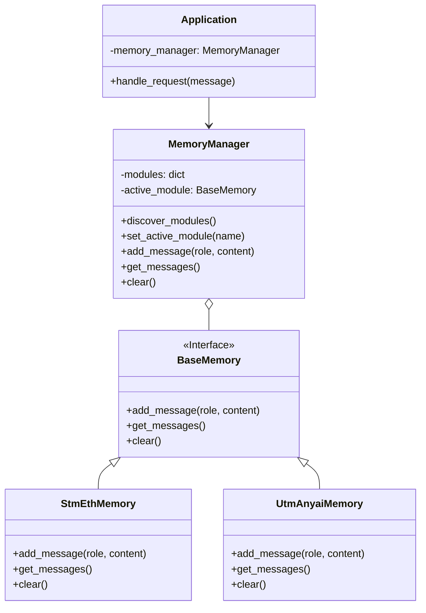
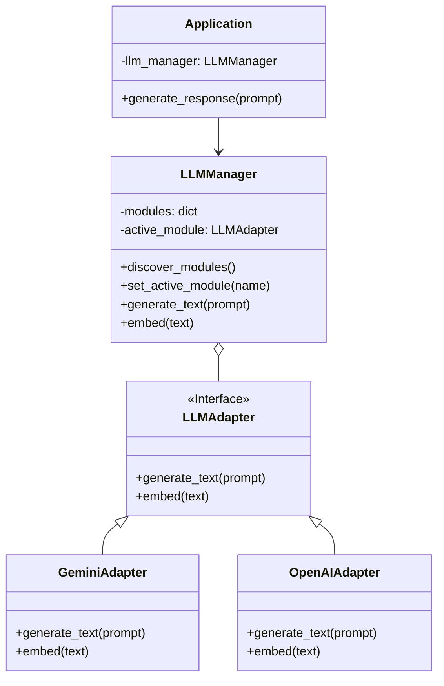
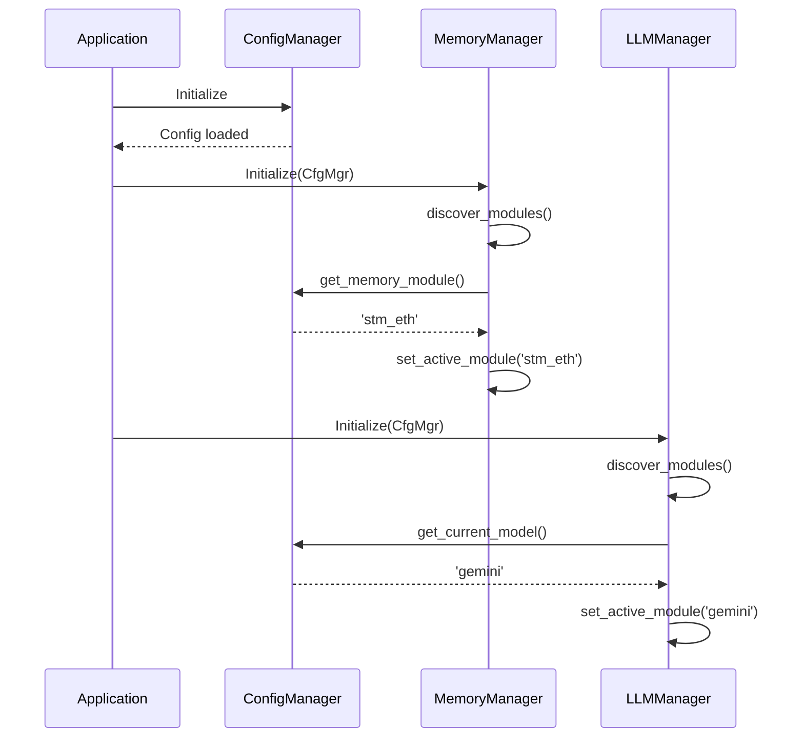
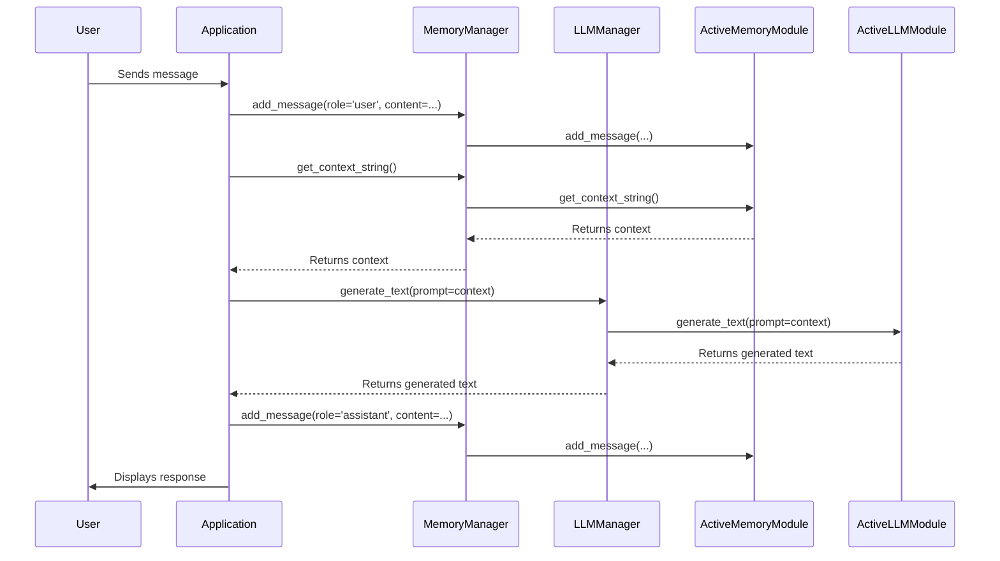

# Modular Architecture Refactor for LLM and Memory Management

## 1. Overview

This document outlines a new modular architecture for the application, focusing on refactoring `llm_manager.py` and `memory_manager.py` to act as central "switchboards." This design decouples the core application from the specific implementations of LLM and memory modules, allowing for greater flexibility and easier extension.

The core principles of this refactor are:
- **Centralized Control:** `config/manager.py` will manage configuration persistence (e.g., which modules are active).
- **Domain-Specific Switchboards:** `LLMManager` and `MemoryManager` will handle the discovery, loading, and orchestration of their respective modules.
- **Encapsulation:** The rest of the application will only interact with the fixed, stable interfaces of the managers, not the individual modules.

## 2. Component Responsibilities

| Component | Responsibilities |
| :--- | :--- |
| **`ConfigManager`** | - Loads and saves application configuration (e.g., `config.json`).<br>- Manages API keys and other sensitive data from environment variables.<br>- Provides the names of the active LLM and memory modules to the respective managers. |
| **`LLMManager`** | - Discovers available LLM modules in the `llms/` directory.<br>- Manages the lifecycle of LLM modules.<br>- Exposes a fixed interface (`generate_text`, `embed`) to the application.<br>- Routes calls to the currently active LLM module. |
| **`MemoryManager`** | - Discovers available memory modules in the `memory/` directory.<br>- Manages the lifecycle of memory modules.<br>- Exposes a fixed interface (`add_message`, `get_messages`, etc.) to the application.<br>- Routes calls to the currently active memory module. |
| **Application Core** | - Interacts exclusively with `LLMManager` and `MemoryManager`.<br>- Remains unaware of the specific LLM or memory modules being used. |

## 3. Module Discovery and Registration

The managers will use the following process to discover and register modules:

1.  **Scan Directory:** On initialization, each manager scans its respective directory (`llms/` or `memory/`).
2.  **Import Module:** It identifies valid Python module files (e.g., `gemini.py`) and imports them dynamically.
3.  **Register Module:** It looks for a specific class (e.g., `GeminiAdapter`) and a `module_config` dictionary within the imported module.
4.  **Store in Registry:** The discovered module's class and configuration are stored in an internal dictionary, keyed by the module's name (e.g., "gemini"). The module is only instantiated when it is activated.

## 4. Class Diagrams

### 4.1. Memory Management Architecture



### 4.2. LLM Management Architecture



## 5. Sequence Diagrams

### 5.1. Application Startup and Module Discovery



### 5.2. Handling a User Request



## 6. Proposed Class Interfaces

### 6.1. `MemoryManager`

```python
# memory/memory_manager.py

from typing import List, Dict

class MemoryManager:
    def __init__(self, config_manager):
        self.config_manager = config_manager
        self.modules = {}
        self.active_module = None
        self._discover_modules()
        self.set_active_module(self.config_manager.get_memory_module())

    def _discover_modules(self):
        # Logic to scan memory/ directory, import modules,
        # and populate self.modules dictionary.
        pass

    def set_active_module(self, name: str):
        # Logic to instantiate and set the active module from self.modules.
        pass

    def add_message(self, role: str, content: str, session_id: str = "default"):
        self.active_module.add_message(role, content, session_id)

    def get_messages(self, session_id: str = "default") -> List[Dict]:
        return self.active_module.get_messages(session_id)

    def clear(self, session_id: str = "default"):
        self.active_module.clear(session_id)

    def get_context_string(self, session_id: str = "default") -> str:
        return self.active_module.get_context_string(session_id)
```

### 6.2. `LLMManager`

```python
# llms/llm_manager.py

from typing import List

class LLMManager:
    def __init__(self, config_manager):
        self.config_manager = config_manager
        self.modules = {}
        self.active_module = None
        self._discover_modules()
        self.set_active_module(self.config_manager.get_current_model())

    def _discover_modules(self):
        # Logic to scan llms/ directory, import modules,
        # and populate self.modules dictionary.
        pass

    def set_active_module(self, name: str):
        # Logic to instantiate and set the active module from self.modules.
        # This will also involve fetching the correct API key.
        pass

    def generate_text(self, prompt: str, **kwargs) -> str:
        return self.active_module.generate_text(prompt, **kwargs)

    def embed(self, text: str) -> List[float]:
        return self.active_module.embed(text)